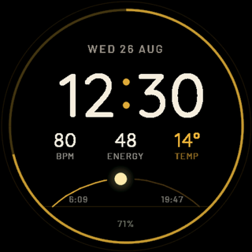

# Dino Kliček

Frontend engineer based in Croatia. I ship small tools: Angular form controls, browser extensions, an IDE plugin, watch faces.

Angular and TypeScript most days. Web scraping in my spare time, which is where the power-outage extension came from.

[LinkedIn](https://www.linkedin.com/in/dineeek) · [Email](mailto:dineeek.dev@gmail.com) · [npm](https://www.npmjs.com/~dklicek) · [JetBrains Marketplace](https://plugins.jetbrains.com/vendor/dineeek)

## Things I've shipped

| Tool | What it does | Where |
|-|-|-|
| [Angular/Nx Scaffolder](https://github.com/dineeek/ng-nx-scaffolder) | IntelliJ and WebStorm plugin that scaffolds Angular and Nx libraries with standalone components, `inject()` and signalStore already wired. Written in Kotlin. |  |
| [ngx-libs-workspace](https://github.com/dineeek/ngx-libs-workspace) | Five reactive Angular form controls built on Signal Forms, themable with CSS custom properties, free of Material, CDK and `ControlValueAccessor`. Packages listed below. | [Live playground](https://dineeek.github.io/ngx-libs-workspace) |
| [hep-bez-struje](https://github.com/dineeek/hep-bez-struje) | Chrome extension that shows which areas of Croatia are without power, scraped from the HEP site. React and TypeScript. |  |
| [najbrzi-prst](https://github.com/dineeek/najbrzi-prst) | Chrome extension that clicks a chosen button at an exact server-synced second. Made for Croatian public calls where funds go by order of receipt. |  |

## npm packages

| Package | What it does | Downloads |
|-|-|-|
| [ngx-numeric-range-form-field](https://github.com/dineeek/ngx-libs-workspace/tree/main/libs/ngx-numeric-range-form-field) | Two number inputs, one value, with validators for order, bounds, completeness and span. |  |
| [ngx-pass-code](https://github.com/dineeek/ngx-libs-workspace/tree/main/libs/ngx-pass-code) | OTP and pass-code input, one box per character, paste anywhere. |  |
| [ngx-phone-form-field](https://github.com/dineeek/ngx-libs-workspace/tree/main/libs/ngx-phone-form-field) | Country picker with flags plus national number, stored as one E.164 string. |  |
| [ngx-time-range-form-field](https://github.com/dineeek/ngx-libs-workspace/tree/main/libs/ngx-time-range-form-field) | Two time inputs, one value, same validator set as the numeric range. |  |
| [ngx-overflow-tooltip](https://github.com/dineeek/ngx-libs-workspace/tree/main/libs/ngx-overflow-tooltip) | Headless directive that exposes an `isTruncated` signal when an element's text is ellipsized. |  |
| [crnk-filtering](https://github.com/dineeek/crnk-filtering) | Zero-dependency builder for CRNK and JSON:API filter, sort and pagination query strings. Works with any HTTP client. |  |

## What I'm working on

| | |
|-|-|
| **Maintaining** | [ngx-libs-workspace](https://github.com/dineeek/ngx-libs-workspace), keeping the five controls current with Angular Signal Forms. |
| **Building** |  Four Garmin Connect IQ watch faces in Monkey C: Noir Aurum, Azimuth, Console and Croata. Packaged, store listings next. |
| **Exploring** | Zoneless Angular, and where AI-assisted development saves time versus where a generator like the scaffolder does it cheaper. |

## Stack

Angular, TypeScript, Nx, NgRx signals, RxJS, Jest, Playwright. Kotlin for the IDE plugin, Monkey C for the watch faces.

Also comfortable on the Java/Quarkus side: SQL, PDF and email templating, Helm and GitOps config.

<picture>
  <source media="(prefers-color-scheme: dark)" srcset="https://raw.githubusercontent.com/dineeek/dineeek/output/github-snake-dark.svg" />
  <source media="(prefers-color-scheme: light)" srcset="https://raw.githubusercontent.com/dineeek/dineeek/output/github-snake.svg" />
  
</picture>
